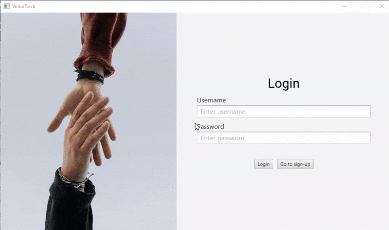

# VolunTrack

## Table of contents
* [General info](#general-info)
* [Technologies](#technologies)
* [Setup](#setup)
* [Author](#author)

## General info
JavaFX application that tracks community volunteering projects.

## Technologies
* Java
* JavaFX

## Setup
Before cloning the repository, ensure you have the necessary JDK installed (that includes JavaFX). One can be installed from [Azul](https://www.azul.com/downloads/?package=jdk#zulu).

After installing the JDK, you may start the application from VSCode.

## Author
* Falah Rasyidi